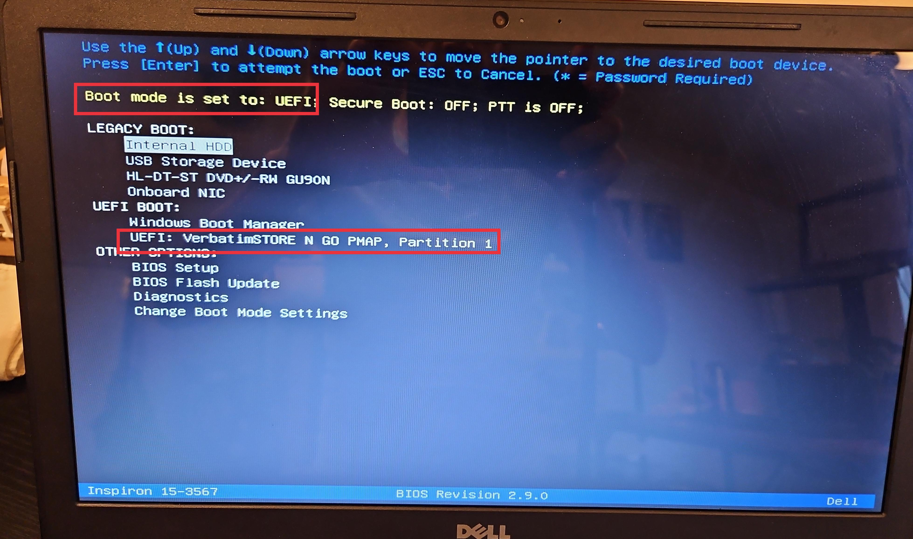
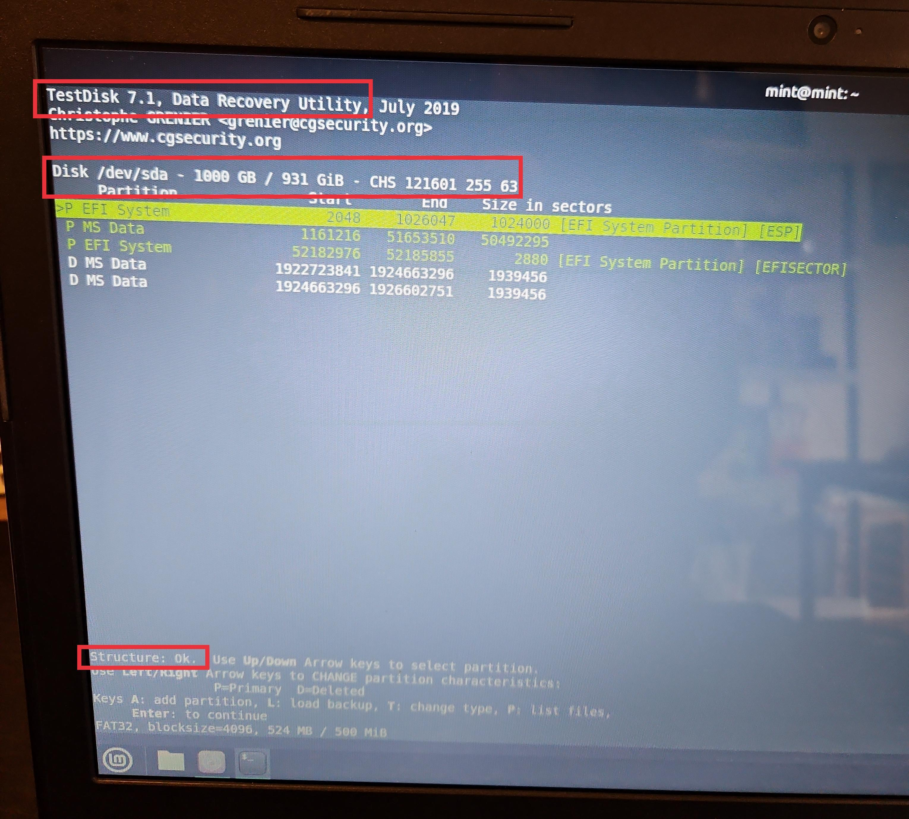
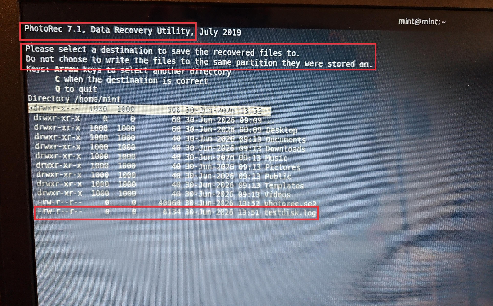
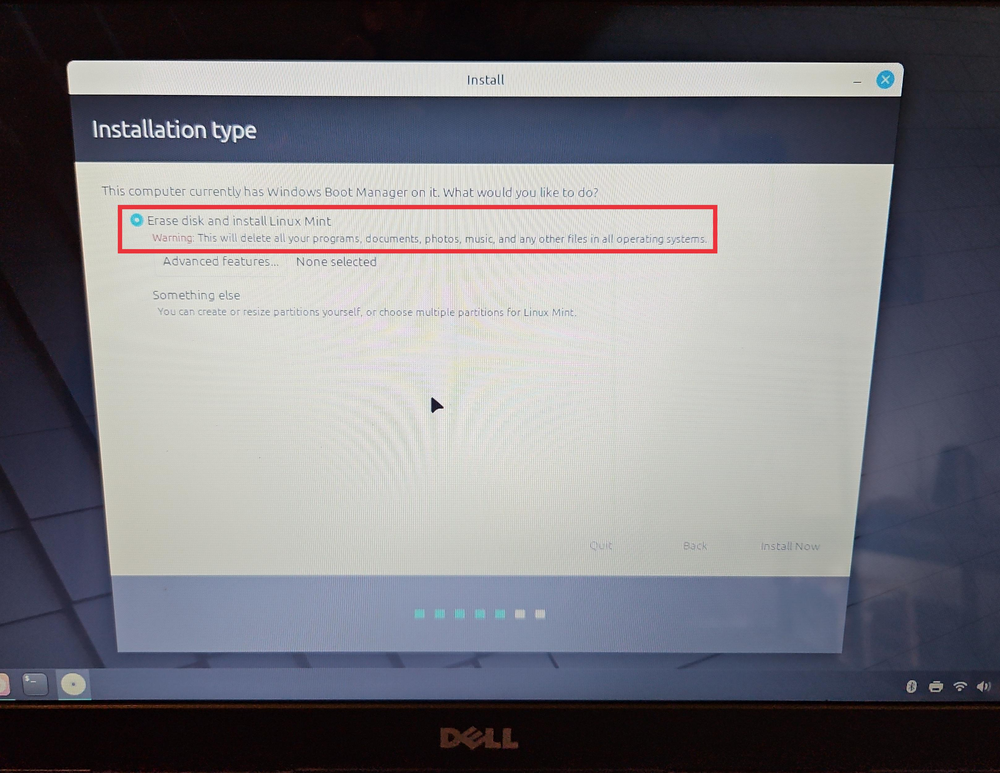
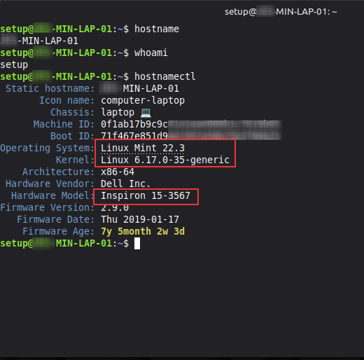
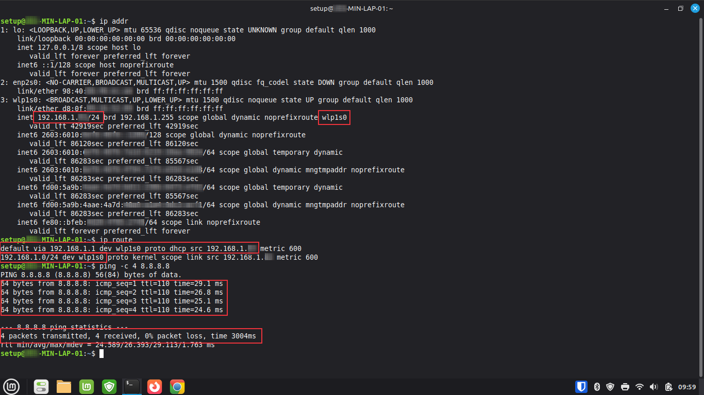
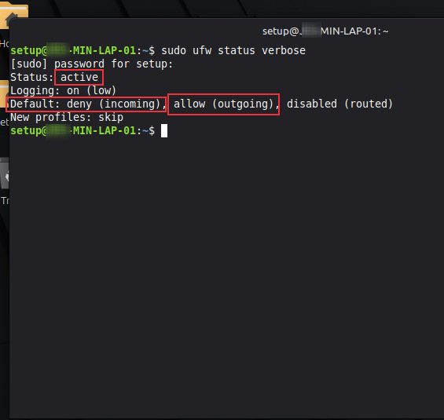
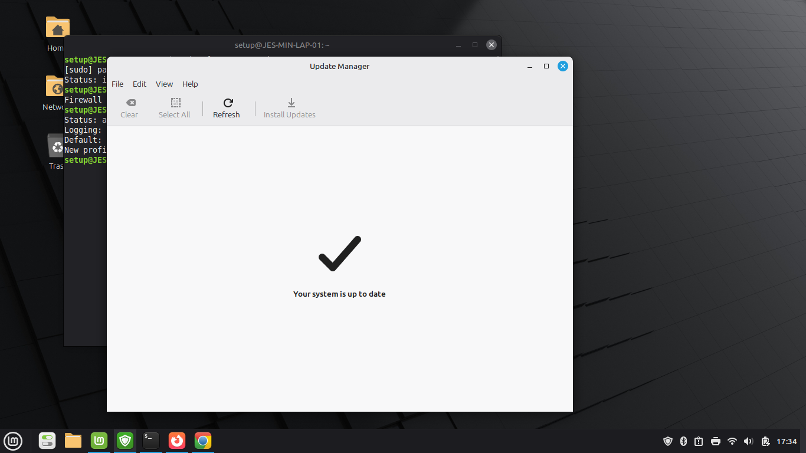

**Linux Mint Secure Deployment**

Linux Mint workstation deployment and configuration documentation with screenshots and verification steps.

I built this project to document the end-to-end deployment of a Linux Mint workstation on a Dell Inspiron 15.

Throughout this project, I installed Linux Mint using UEFI firmware, configured the workstation, and verified hardware and operating system information. Using Bash, I validated network connectivity, enabled the Linux firewall, installed system updates, and explored file recovery tools such as TestDisk and PhotoRec. Each section demonstrates not only the technical task but also how I document and verify the work that I do.

This repository emphasizes technical documentation, verification, and repeatable procedures. Every screenshot was selected to highlight an important part so that another technician can theoretically reproduce my deployment process.

Lab Objectives
- Install Linux Mint on physical hardware
- Boot using UEFI firmware
- Erase the existing Windows installation
- Verify successful operating system installation
- Configure a hostname and user account
- Collect system information
- Configure and verify network connectivity
- Enable and verify the Linux firewall
- Update the operating system
- Perform basic disk analysis with TestDisk
- Recover deleted files using PhotoRec
- Document each configuration step using screenshots

Create Bootable Installation Media

I downloaded the Linux Mint ISO and created a bootable USB drive so the workstation could boot into the Linux Mint live environment. Using bootable installation media can serve as the first step in deploying a new operating system on a physical machine.

UEFI Boot Configuration

I booted the USB installer in UEFI mode before beginning the installation. Using UEFI supports modern hardware and GPT partitioning.

- `UEFI` confirms the installer booted in UEFI mode.
- `Verbatim` displays the detailed boot process during startup.
- `Partition 1` confirms the installer was loaded from the bootable USB drive.

Disk Partition Analysis

I used TestDisk to examine the storage device and verify the partition layout. This demonstrates familiarity with disk recovery utilities and the ability to inspect storage structures during troubleshooting or recovery scenarios.

- `/dev/sda` identifies the physical storage device being examined.
- `Structure: OK` confirms the disk structure was successfully read.
- `Partition` list displays the detected partitions before installation.

File Recovery

I used PhotoRec to demonstrate file recovery by selecting a destination for recovered files. This highlights the importance of recovering data to a different storage location to avoid overwriting recoverable information.

- `PhotoRec 7.1` identifies the recovery utility used.
- `testdisk.log` records recovery activity for later review.
- Recovery destination shows the location where recovered files are saved without writing back to the source drive.

Linux Mint Installation

I installed Linux Mint by replacing the existing Windows installation on the workstation. This demonstrates a clean operating system deployment and prepares the computer for configuration and security hardening.

- `Erase disk and install Linux Mint` performs a clean operating system installation.

System Information

After installation, I verified the operating system version, Linux kernel, hardware model, and hostname. Collecting this information confirms that the workstation was successfully deployed and provides baseline documentation for future administration.

Network Connectivity

I verified the workstation's network configuration by reviewing the assigned IP address, routing table, and testing Internet connectivity. This confirms that the workstation successfully obtained network settings and can communicate with external resources.

Firewall Configuration

I verified that the Uncomplicated Firewall (UFW) was enabled with a secure default policy. The firewall blocks unsolicited inbound traffic while allowing outbound connections, providing a secure baseline configuration for the workstation.

System Updates

I updated the operating system after installation to install the latest security patches, bug fixes, and software updates. Keeping systems current is a fundamental security practice that helps reduce exposure to known vulnerabilities.

Skills
- Linux Mint
- UEFI Boot Configuration
- Operating System Installation
- Workstation Deployment
- Computer Networking
- IPv4 Networking
- Hostname Configuration
- Linux Terminal (Bash)
- UFW Firewall
- TestDisk
- PhotoRec
- Package Management
- System Documentation
- Technical Writing
- GitHub Documentation

Summary

I built this project to practice deploying a Linux Mint workstation from beginning to end while documenting each stage of the process. Rather than focusing only on the installation itself, I included pre-installation file recovery, system verification, networking, firewall configuration, and software updates to demonstrate a complete workstation deployment workflow.

By organizing the project into work instructions with screenshots, I created documentation that another technician can follow, verify, and reproduce. This reflects the documentation practices commonly used in IT support and systems administration environments.

Although I used Linux tools for this project, the concepts demonstrated - system deployment, verification, security configuration, and documentation - are fundamental systems administration practices that apply across enterprise IT environments.

Navigation

[`Back to GitHub Profile`](https://www.github.com/cbueker-it)
